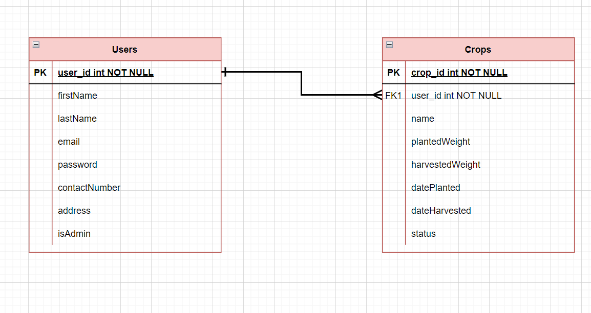

# Back-end nodeJS project

## Developer

Jefferson D. Rosimo

## About the app

This is a backend for vepply, a vegetable production monitoring app. Users can monitor currently planted vegetable crops.

### User stories

1. As a user, i want to monitor the current supply production of vegetables so that i would know what to produce and what not to.
2. As a user, i must be able to register an account and login using that account
3. As a user, i must be able to delete or harvest my crops.
4. As a user, i want to add and register my currently planted vegetable crop so that i will be able to inform and help other users in monitoring the current status of production of a certain vegetable crop
5. As an admin, i want to approve pending vegetable crops added by user so that all crops added are verified and inspected before being reflected to the data shown in dashboard and crop list.

#### Technologies used

- MongoDB
- NodeJS
- ExpressJS
- thunder client
- mongoose
- morgan
- body-parser
- bcrypt
- cors (cross-origin resource sharing)
- helmet

---

### Entity Relationship Diagram (ERD)

### Database and API design

| URL                                 | HTTP verb | CRUD   | Description                                        |
| ----------------------------------- | --------- | ------ | -------------------------------------------------- |
| /login                              | POST      | Create | Log in and find user if it has a match in database |
| /register                           | POST      | Create | Create a user                                      |
| /api/v1/users/:userId               | PUT       | Update | Update user details                                |
| /api/v1/crops/:userId               | POST      | Create | Create a crop from a specific user                 |
| /api/v1/users/:userId/crops         | GET       | Read   | Get all crops from a specific user                 |
| /api/v1/users/:userId/crops/:cropId | PUT       | Update | Update the user's list of added crop               |
| /api/v1/crops/:cropId               | DELETE    | Delete | Delete crop                                        |
| /api/v1/crops/:cropId               | PUT       | Update | Update crop                                        |

---

#### Powered by

- [app.diagrams.net](https://app.diagrams.net/)
- [Tables generator](https://www.tablesgenerator.com/markdown_tables)
- [README template](https://github.com/orjames/mernProject#about-the-app)
